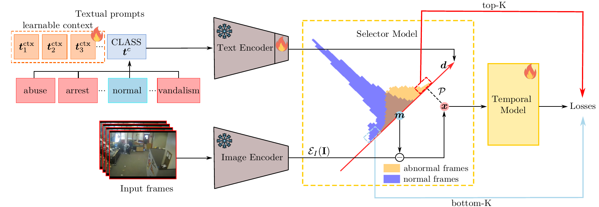

<div align="center">

[](https://arxiv.org/abs/2310.02835)
[](https://luca-zanella-dvl.github.io/AnomalyCLIP/)

# Delving into CLIP latent space for Video Anomaly Recognition

Luca Zanella\*, Benedetta Liberatori\*, [Willi Menapace](https://www.willimenapace.com/), [Fabio Poiesi](https://fabiopoiesi.github.io/), [Yiming Wang](https://www.yimingwang.it/), [Elisa Ricci](http://elisaricci.eu/) <br>
`*` denotes equal contribution

</div>

<p align="center">
  
</p>
<br>

> **Abstract:** *We tackle the complex problem of detecting and recognising anomalies in surveillance videos at the frame level, utilising only video-level supervision. We introduce the novel method AnomalyCLIP, the first to combine Large Language and Vision (LLV) models, such as CLIP, with multiple instance learning for joint video anomaly detection and classification.
> Our approach specifically involves manipulating the latent CLIP feature space to identify the normal event subspace, which in turn allows us to effectively learn text-driven directions for abnormal events.
> When anomalous frames are projected onto these directions, they exhibit a large feature magnitude if they belong to a particular class. We also introduce a computationally efficient Transformer architecture to model
> short- and long-term temporal dependencies between frames, ultimately producing the final anomaly score and class prediction probabilities. We compare AnomalyCLIP against state-of-the-art methods considering three major anomaly detection benchmarks, i.e., ShanghaiTech, UCF-Crime, and XD-Violence, and empirically show that it outperforms baselines in recognising video anomalies.*

# Setup

We recommend the use of a Linux machine with CUDA compatible GPUs. We provide both a Conda environment and a Dockerfile to configure the required libraries.

Clone the repo with:

```bash
git clone https://github.com/luca-zanella-dvl/AnomalyCLIP
cd AnomalyCLIP
```

## Conda

The environment can be installed and activated with:

```bash
conda create --name anomalyclip python=3.8
conda activate anomalyclip
pip install -r requirements.txt
```

## Docker

Use the Dockerfile to build the docker image:

```bash
docker build -t anomalyclip -f docker/Dockerfile .
```

Run the docker image by mounting the project root to `/usr/src/app` and the datasets folder to `/usr/src/datasets` in the docker container:

```bash
docker run --gpus '"device=0"' --rm -it -v /path/to/directory/AnomalyCLIP/:/usr/src/app -v /path/to/directory/datasets/:/usr/src/datasets anomalyclip /bin/bash
```

# Preparing Datasets

## Pre-extracted Features

We recommend to use pre-extracted features to accelerate training. Please download the extracted Vit-B/16 features for ShanghaiTech, UCF-Crime and XD-Violence datasets from links below:

|   Dataset    | Feature Backbone |                                                 Link                                                  |
| :----------: | :--------------: | :---------------------------------------------------------------------------------------------------: |
| ShanghaiTech |  ViT-B/16-CLIP   | [Google Drive](https://drive.google.com/file/d/1jbpK1jQkYgZMXF_DyIGy__0ZKYrSoUsj/view?usp=drive_link) |
|  UCF-Crime   |  ViT-B/16-CLIP   | [Google Drive](https://drive.google.com/file/d/1mHMYT_udmszNoGdHzCgahSrv0Fqwd6Di/view?usp=drive_link) |
| XD-Violence  |  ViT-B/16-CLIP   | [Google Drive](https://drive.google.com/file/d/1LrhG-qx6UvZc5AHXpz8DPLSRRdFf22pV/view?usp=drive_link) |

and place them in the `/path/to/directory/datasets` folder.

# Pretrained Models

Pretrained models are available for all the datasets and can be downloaded at the following [Google Drive](https://drive.google.com/file/d/1kgifxpoVn6EwZUIbZ0DbA8zI88aaVPV3/view?usp=drive_link) link.

Please place the `checkpoints` folder under the project root folder.

# Training

To train AnomalyCLIP on ShanghaiTech, UCF-Crime and XD-Violence using the pre-extracted features, run the following bash script:

```bash
python src/train.py experiment=<dataset_name>
```

choosing `dataset_name` from one of `shanghaitech`, `ucfcrime` and `xdviolence`.

To train AnomalyCLIP on ShanghaiTech, UCF-Crime and XD-Violence from frames, run the following bash script:

```bash
python src/train.py experiment=<dataset_name> data.load_from_features=False data.frames_root=/path/to/directory/frames/ data.frames_root_val=/path/to/directory/frames/
```

after extracting frames from video data in the folder `/path/to/directory/frames/`.

# Evaluation

The trained models can be evaluated on the dataset of interest by running the following bash script:

```bash
python src/eval.py model=anomaly_clip_<dataset_name> data=<dataset_name> ckpt_path=/path/to/checkpoints/<dataset_name>/last.ckpt
```

# Citation

Please consider citing our paper in your publications if the project helps your research.

```
@article{zanella2023delving,
  title={Delving into CLIP latent space for Video Anomaly Recognition},
  author={Zanella, Luca and Liberatori, Benedetta and Menapace, Willi and Poiesi, Fabio and Wang, Yiming and Ricci, Elisa},
  journal={arXiv preprint arXiv:2310.02835},
  year={2023}
}
```
